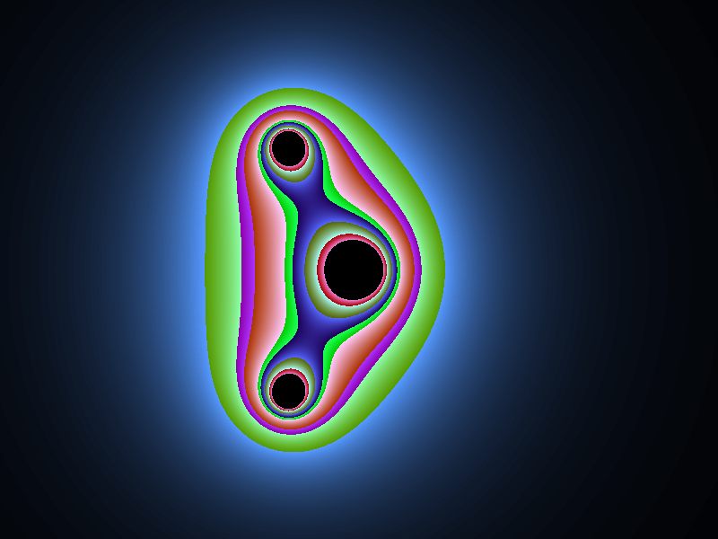
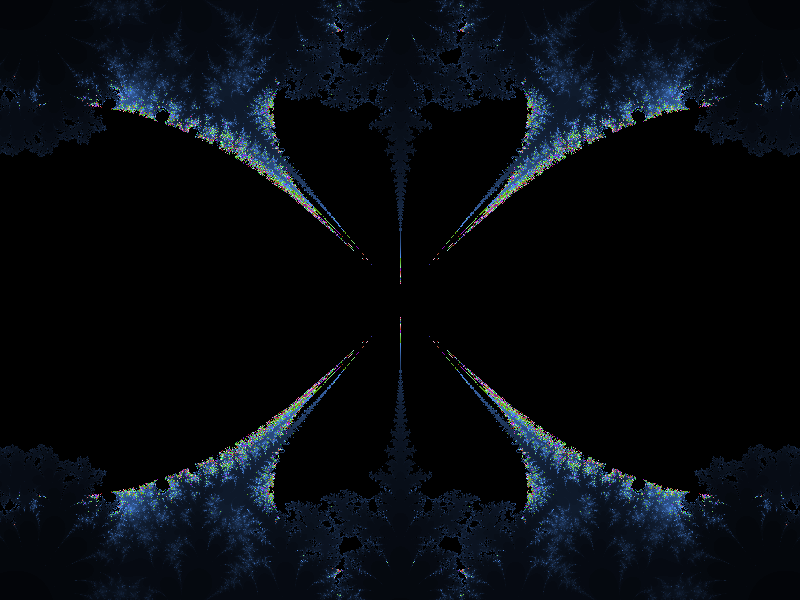
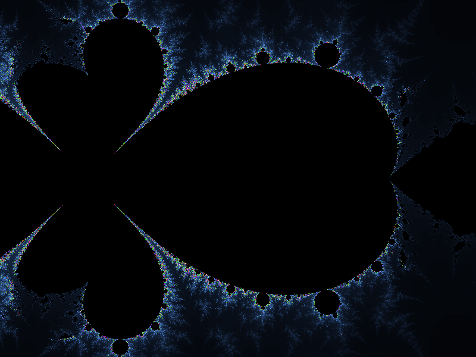
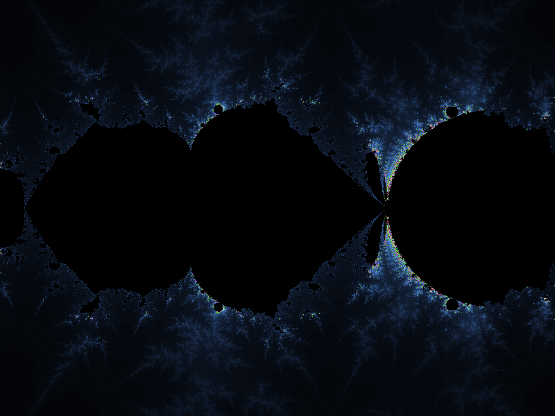

# Mandelbrot_set
Mandelbrot Set simulation written in C++ and SDL 2

The Mandelbrot set is defined in the complex plane as the complex numbers $` c `$ for which the function $` f_c(z) = z^2 + c `$ does not diverge to infinity when iterated starting at $` z = 0 `$.

More informations at [Mandelbrot set - Wikipedia](https://en.wikipedia.org/wiki/Mandelbrot_set)

---

Here some images computed with different functions:

- $` f_c(z) = z^2 + c `$

- $` f_c(z) = z^2 + \sqrt{c} `$

- $` f_c(z) = z + c^3 + c^2 + c `$

- $` f_c(z) = c - \sin{z} `$

- $` f_c(z) = c - \cos{z} `$

- $` f_c(z) = c - \sin{z} -\cos{z} `$

